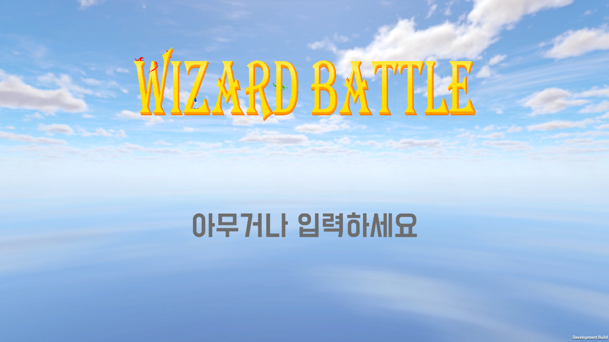

# Wizard Battle

💡 **Wizard Battle**는 원하는 속성의 마법사와 스킬을 선택하여 다른 마법사와 서로 겨루는 FPS 멀티 3D 게임입니다. 
『해리포터 비밀의 방』의 [결투 클럽](https://youtu.be/ZAf3U0J8Se8?feature=shared)을 보고 영감을 받아 제작하였습니다.  
PC와 VR의 크로스 플레이를 지원합니다. 
 
[개발 Repository 가기](https://github.com/qkrwoaks/WizardBattle) 
 
📆 제작 기간 : 2022.11 ~ 2023.01 (약 3개월)

## 🔍 인게임

 
-타이틀 화면-

 
-게임 참가 화면-

 
-로비 화면-

 
-스킬 선택 화면-

 
-인게임 화면-

 
-게임 결과-

## 👥 팀원

[박재만](https://github.com/qkrwoaks)(유니티 클라이언트·VR 개발자, PM) 플레이어의 이동, 장판·궁극기 구현, 맵 배치, VR을 담당하였습니다.

[박지예](https://github.com/jiye-stingray)(유니티 클라이언트 개발자) [Photon](https://www.photonengine.com/ko-kr#)을 사용하여 상대의 공격 로직 구현, PC·VR에 맞는 UI 담당, 마법 이펙트 담당하였습니다.

[정명직](https://github.com/wjdaudwlr)(유니티 클라이언트 개발자) [Photon](https://www.photonengine.com/ko-kr#)을 사용하여 게임의 멀티 부분을 담당하였습니다.

[박연우](https://github.com/Yeonwoo05)(디자이너) Aseprite(도트 디자인 툴)을 사용하여 게임의 디자인 담당하였습니다.